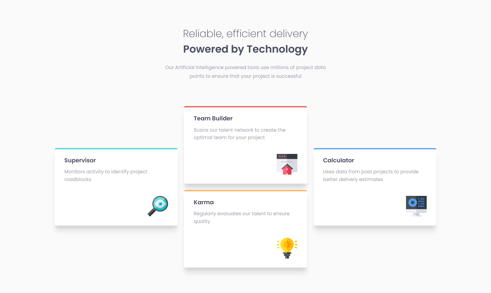
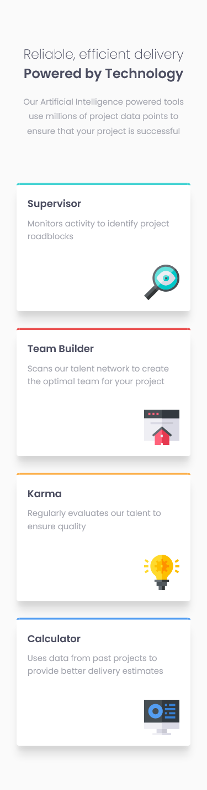

# Frontend Mentor - Four card feature section solution

This is a solution to the [Four card feature section challenge on Frontend Mentor](https://www.frontendmentor.io/challenges/four-card-feature-section-weK1eFYK). Frontend Mentor challenges help you improve your coding skills by building realistic projects.

## Table of contents

- [Overview](#overview)
  - [The challenge](#the-challenge)
  - [Screenshot](#screenshot)
  - [Links](#links)
  - [Built with](#built-with)

## Overview

### The challenge

Users should be able to:

- View the optimal layout for the site depending on their device's screen size

### Screenshot

  

### Links

- Solution URL: [Github](https://github.com/zyryle/FM-four-card-feature-section)
- Live Site URL: [Github Pages](https://zyryle.github.io/FM-four-card-feature-section/)

### Built with

- Mobile-first workflow
- Flexbox
- CSS Grid
- Semantic HTML5 markup
- CSS custom properties
